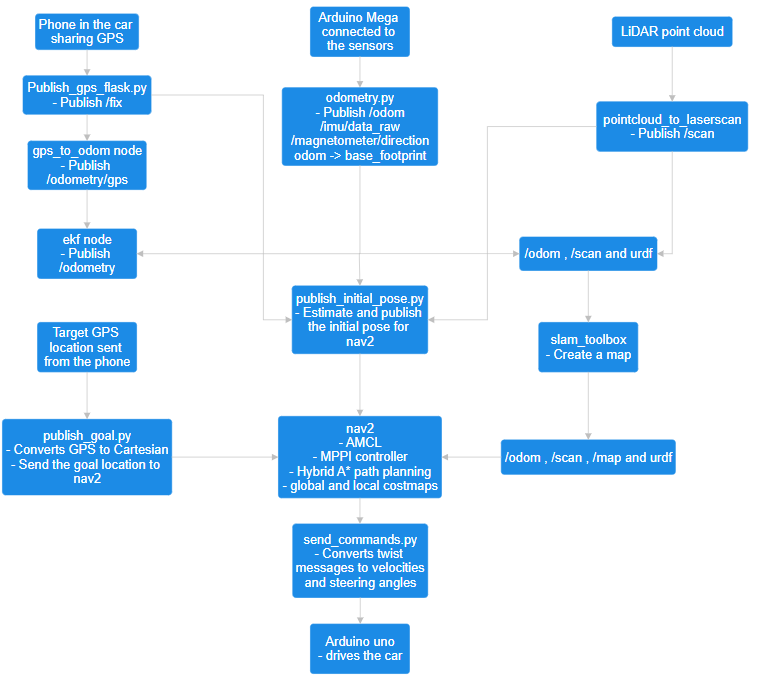

# Autonomous_Golf_Car
An autonomous golf cart that navigates a university campus using a SLAM-created map. It receives the target GPS location via Telegram and efficiently navigates to the destination while avoiding obstacles.

## Project Overview
This project involves the development of an autonomous golf cart capable of precise navigation within a university campus. The system integrates various sensors and algorithms to achieve robust and reliable navigation and obstacle avoidance.



## Key Features
- **Arduino Integration:** 
  - One Arduino controls the car by sending velocity and steering angle commands.
  - Another Arduino connects to the sensors (IMU and proximity sensors acting as wheel encoders).
- **Odometry:** Python script (`odometry.py`) gathers sensor data and calculates odometry.
- **LiDAR Processing:** Uses the Velodyne package to obtain LiDAR point clouds and the `pointcloud_to_laserscan` package to convert 3D point clouds into 2D laser scans.
- **SLAM for Mapping:** Created a map of the university using `slam_toolbox` with the collected scan and odom data.
- **Navigation:** Utilizes `nav2` with MPPI controller and Hybrid A* planner for navigating the map.
- **Initial Position Estimation:** 
  - `publish_initial_pose.py` estimates the initial position and heading using GPS and magnetometer data.
  - GPS data is converted to Cartesian coordinates (ENU frame) and transformed to the map frame.
  - Magnetometer reading provides the heading estimation.
  - ICP algorithm refines the position by matching LiDAR scan readings with a simulated scan in the map at the position estimated by the GPS and Magnetometer.
- **Goal Positioning:** 
  - `publish_goal.py` takes GPS coordinates via Telegram, matches them to predefined GPS coordinates for known locations in the university, and publish the corresponding (x, y, yaw) coordinates as the goal.
- **Steering Control:** 
  - `steering.py` converts `cmd_vel` messages from `nav2` into steering angle and velocity commands for the Arduino.
- **Emergency Stop:** 
  - Listens to the `/stop_car` topic and stops the car when a signal is sent by a phone to`stop_car_telegram.py` or `stop_car_flask.py`.
- **GPS Integration:** 
  - Enhances odometry using a GPS sensor or a phone.
  - `publish_gps_flask.py` or `publish_gps_telegram.py` can be used to send GPS data from the phone, which is then converted to map coordinates by `gps_to_odom.py`.
  
## Demonstration Video
Watch the autonomous golf cart in action: [Demo Video](images/video.MP4)

## Getting Started

### Prerequisites
- ROS2 Humble
- Arduino IDE
- Python 3.8+
  
### Installation
1. **Clone the repository:**
    ```sh
    git clone https://github.com/HazemAshrf/Autonomous_Golf_Car.git
    cd Autonomous_Golf_Car
    colcon build
    ```

2. **Setup Arduino:**
    - Upload the relevant Arduino sketches from the `arduino_codes` directory to the Arduino boards.

## Acknowledgments

This project includes modified versions of the following packages:

- [navigation2](https://github.com/ros-planning/navigation2) - ROS2 Navigation System
- [velodyne](https://github.com/ros-drivers/velodyne) - Velodyne Lidar Driver
- [pointcloud_to_laserscan](https://github.com/ros-perception/pointcloud_to_laserscan) - Pointcloud to Laser Scan Conversion

I have modified these packages to fit the needs of my autonomous golf car project. All original licenses and acknowledgments are retained.
